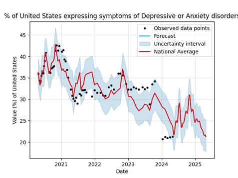
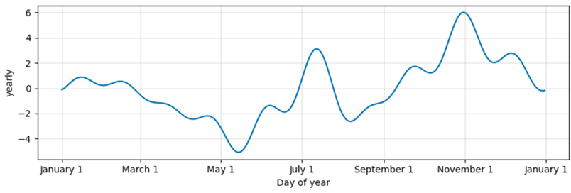

# Unmasking Anxiety: The hidden groups of anxiety and depression since 2020

## Table of Contents
1. Project Overview
2. Objectives
3. Usage and Installation Instructions
4. Analysis and Insights
5. Data License and Fair Use
6. Potential Bias
7. End Goal
8. At-Risk Groups
9. Data Description
10. Methodology
11. Results
12. Conclusion and Recommendations
13. Contributors
14. Acknowledgments
15. Contact Information

## Project Overview
This project, conducted by Northwestern AI Bootcamp participants Alexander Baraban, Ryan Hough, and Michael Nicholas, aims to evaluate the frequency of weekly reported symptoms of anxiety since 2020, using data from the US Department of Health and Human Services.

**Dataset:** _[Indicators of Anxiety or Depression Based on Reported Frequency of Symptoms During Last 7 Days](https://catalog.data.gov/dataset/indicators-of-anxiety-or-depression-based-on-reported-frequency-of-symptoms-during-last-7-)_

## Objectives
**1. Trend Evaluation:** Assess trends within specific sub-categories of the population to explore the varying impacts of the COVID-19 lockdown on mental health.\
**2. Resource Planning:** Provide insights to clients to aid in evaluating key needs within the industry and planning resources to support the mental health of various demographic groups.

## Usage and Installation Instructions
Installation
Clone the Repository:

bash
Copy code
git clone https://github.com/yourusername/project-1.git
cd project-1
Create a Virtual Environment:

bash
Copy code
python -m venv venv
source venv/bin/activate  # On Windows use `venv\Scripts\activate`
Install Dependencies:

bash
Copy code
pip install -r requirements.txt
Download the Dataset:
Download the dataset from Data.gov and place it in the data/ directory.

Usage
Run the Analysis Script:

bash
Copy code
python analysis.py
Generate Reports:
The results and insights will be saved in the output/ directory.

Google Collab:
You can explore the data and analysis by running the Google Collab:

bash
Copy code
jupyter notebook analysis.ipynb

## Analysis and Insights
### Analysis 
Our analysis focused on understanding the trends and causes of anxiety symptoms since the COVID-19 lockdown. We performed the following steps:

* **Descriptive Statistics:** Calculated mean of anxiety and depressive symptoms across different demographic groups.
* **Time Series Analysis:** Analyzed trends over time, focusing on periods during and after the lockdown.
* **Predictive Modeling:** Used machine learning models to predict groups at risk for anxiety symptoms.

### Insights
* Seasonal variations in anxiety symptoms.
* Differences across age groups, gender, and race.
* Impact of time periods during and after lockdown.

## Data License and Fair Use
* This data is intended for public access and use, as per the website.
* The data has been sourced from Data.gov and provided through the US Department of Health and Human Services. Specific restrictions may exist regarding the use of text, trademarks, logos, and images, which have not been duplicated in this project.

## Potential Bias
* **Voluntary Response:** May underrepresent or overrepresent people with depression or anxiety symptoms.
* **Internet Questionnaire:** Households without internet, computers, phones, or emails are underrepresented.
* **Housing Units:** Underrepresents homeless individuals.
* **Single Respondent per Housing Unit:** Potential bias from only one respondent per unit.

## End Goal
The project's ultimate goal is to predict whether a group may be at risk for depressive or anxiety symptoms and provide insights to potential clients for resource allocation in mental health services.  At risk is being defined as having a significantly higher predicted symptom rate than the national average

## At-Risk Groups
* **By Age:** 18-29
* **By Gender Identity:** Transgrender
* **By Disability Status:** With Disability
* **By Sexual Orientation:** Bi-Sexual
* **By Race:** Non-Hispanic, other races and multiple races

## Data Description
The dataset used for this project is sourced from the US Department of Health and Human Services and contains indicators of anxiety or depression based on reported frequency of symptoms during the last seven days. Key features include:

* **Indicator** _Symptoms of Anxiety Disorder; Symptoms of Depressive Disorder; Symptoms of Anxiety Disorder or Depressive Disorder_
* **Group:** 
    * **National Estimate:** _United States_
    * **By Age:** _18 - 29 Years; 30 - 39 Years; 40 - 49 Years; 50 - 59 Years; 70 - 79 Years; 80 Years and Above_
    * **By Sex:** _Female; Male_
    * **By Gender Identity:** _Cis-gender Male; Cis-gender Female; Transgender_
    * **By Sexual Orientation:** _Gay or Lesbian; Straight; Bisexual_
    * **By Race/Hispanic Ethnicity:** _Hispanic or Latino; Non-Hispanic Asian single race; Non-Hispanic Black, single race; Non-Hispanic White, single race; Non-Hispanic other races and multiple races_
    * **By Education:** _Less than a High School Diploma; High School Diploma or GED; Some College/Assiciate's Degree; Bachelor's Degree or Higher_
    * **By Disability Status:** _With Disability; Without Disability_

## Methodology
Our methodology consisted of several key steps:

**1. Data Cleaning and Preprocessing:** Ensured the data was clean and ready for analysis.\
**2. Exploratory Data Analysis (EDA):** Gained initial insights and visualized trends.\

### Data Cleaning and Preprocessing
**1. Missing Values:** Handled missing values by imputation or removal.\
**2. Date Handling:** Converted date columns to datetime objects and created additional time-related features (e.g., month, day, year).\

## Results
### Descriptive Statistics
Our initial analysis involved calculating descriptive statistics to understand the distribution of anxiety symptoms across different demographic groups. Key findings include:

* **Average Anxiety Levels:** The average reported frequency of anxiety symptoms was higher among younger adults (18-29) and females.
* **Variation Across Subgroups:** Significant variation was observed across different subgroups, with multiracial, female, and people with disabilities to name a few reporting higher levels of anxiety than the national average.

### Time Series Analysis
We performed a time series analysis to identify trends and patterns in anxiety symptoms over time:

* **Impact of COVID-19 Lockdown:** A noticeable spike in anxiety levels was observed during the initial months of the COVID-19 lockdown, followed by a gradual decline but remaining elevated compared to pre-lockdown levels.

* **Seasonal Trends:** Anxiety levels showed seasonal variations, with peaks around Summer season (July) and leading into holidays (November).

### Predictive Modeling
We employed various machine learning models to predict groups at risk for anxiety symptoms. The model used:

* **Prophet**

### Visualizations
To aid in the interpretation of our findings, we generated several visualizations:

**Reported Anxiety and Depressive symptoms Levels Over Time**

**Reported Anxiety and Depressive Symptoms by Age Group**

**Reported Anxiety and Depressive Symptoms by Race**

**Reported Anxiety and Depressive Symptoms by State**

**Reported Anxiety and Depressive Symptoms by Gender**

**Reported Anxiety and Depressive Symptoms by Sexual Identity**

**Reported Anxiety and Depressive Symptoms by Gender Identity**

**Reported Anxiety and Depressive Symptoms with or without disabilities**

**Reported Anxiety and Depressive Symptoms National Estimate**

### Key Insights
**1. Seasonal Interventions Needed:** Increased mental health support during holidays and significant events can help mitigate anxiety spikes.\
**2. At Risk Groups:** Providing resources and support to 'at risk' groups (at risk being defined as having a significantly higher predicted symptom rate than the national average) can help address higher anxiety levels in these populations.

## Conclusion and Recommendations
### Conclusion
Our analysis indicates that the COVID-19 lockdown had a significant impact on anxiety levels across various demographic groups. Key findings include:

* Younger adults (18-29) and females reported higher levels of anxiety.
* Seasonal variations and specific time periods (e.g., holidays) showed spikes in anxiety symptoms.
* The top 5 "At-Risk" demographic groups include Transgender, With Disabilities, Bi-Sexual, 18-29 and Non-Hispanic other races or multiple race individuals.

### Recommendations and Next Steps (For a Health Care Group focused on providing Mental Health Services)
* **Resource Allocation:** Mental health resources should be prioritized for younger adults and females, especially during peak anxiety periods.
* **Public Health Interventions:** Develop targeted interventions during holidays and significant dates to mitigate anxiety spikes.
* **Further Research:** Continue monitoring anxiety trends to understand long-term effects and emerging patterns.
* **Refocus Media Advertising:** From Covid-19 Resources to At-Risk Groups
* **Provide on-site Awareness:** With targeted campaigns to educated At-Risk groups of Services Available, i.e. Colleges, Universities, LGBTQ organizations, etc.
* **Affordable Mental Health Sevice options:** Educate target at-risk groups of potential free or reduced cost options, such as government programs, employer EAP plans, Health Insurance coverage, etc.
* **Proximity:** Establish office space near "At Risk" regions. 

## Contributors
* Alexander Baraban
* Ryan Hough
* Michael Nicholas

## Acknowledgments
We would like to thank the following individuals and organizations for their support and contributions to this project:

* **Northwestern AI Bootcamp Instructors:** For their guidance and feedback.
* **US Department of Health and Human Services:** For providing the dataset.
* **Data.gov:** For making the data accessible to the public.
* **Our Families and Friends:** For their continuous support and encouragement.

## Contact Information
For questions or collaborations, please contact:

**Alexander Baraban** - alexbaraban17@gmail.com\
**Ryan Hough** - hough.ryanj@gmail.com\
**Michael Nicholas** - mpnicholas21@gmail.com\
